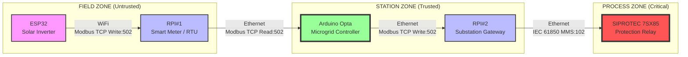

# End-to-End Cyber-Physical Grid Architecture

## 1. System Overview

This architecture simulates a **Digital Substation Control Loop**, explicitly separating the **Field Zone** (Solar Generation) from the **Station Zone** (Protection & Control) and **Process Zone** (Critical Infrastructure). It utilizes a multi-layered approach to mirror real-world Critical Infrastructure logic, data flows, and security segmentation.

**Implementation**: Complete system implemented in `system_v2/` directory.

### Architecture Diagram



---

## 2. Component Roles & Implementation

### 1. ESP32 - Solar Inverter Simulator

**Real World Role**: PV String Inverter
**Implementation**: `system_v2/esp32/`
**Platform**: ESP32 with PlatformIO
**Software**: C++ (Arduino framework)

**Function**:
- Reads pre-processed PV simulation data from Flash memory (PROGMEM)
- Sends telemetry to RPI#1 via Modbus TCP every 10 seconds
- **Data Source**: 8760 hourly samples (1 year) generated from `weather_washingtonDC_2016.xlsx` using pvlib ModelChain
- **Memory**: ~120 KB stored in Flash (4 MB available)

**Protocol**: Modbus TCP Client
**Action**: Writes 8 holding registers to RPI#1 (address 0-7)

**Key Features**:
- WiFi auto-reconnection with exponential backoff
- Modbus write retry logic (3 attempts)
- Serial debug output for monitoring
- PV System Characteristics:
  - Location: Washington DC (38.9072°N, -77.0369°W)
  - Module: Znshine PV Tech ZXP6 72 295 P
  - Inverter: ABB MICRO 0.3 I OUTD US 208
  - Tilt: 35°, Azimuth: 180° (south-facing)

**Configuration**:
```cpp
#define WIFI_SSID "your_network"
#define WIFI_PASSWORD "your_password"
#define RPI1_IP "192.168.1.100"
#define SEND_INTERVAL_MS 10000  // 10 seconds
```

---

### 2. RPI#1 - Smart Meter / Data Concentrator

**Real World Role**: Field Data Aggregator / RTU
**Implementation**: `system_v2/rpi1/`
**Software**: Python 3 with `pymodbus`

**Function**:
- **Inbound (WiFi)**: Modbus TCP Server (Port 502) accepting writes from ESP32
- **Outbound (Ethernet)**: Same server serves reads to Arduino Opta
- Binds to `0.0.0.0:502` (serves both interfaces)
- Decodes and logs all received telemetry
- Tracks statistics (total received from ESP32, total served to Opta)

**Protocol**: Modbus TCP Server
**Data Flow**:
1. ESP32 writes → RPI#1 stores in registers 0-7
2. Opta polls → RPI#1 serves registers 0-7

**Key Features**:
- Simplified from system_v1 (no TLS, no pvlib)
- Dual interface support (WiFi + Ethernet)
- Real-time telemetry logging with human-readable decoding
- Statistics reporting every 60 seconds
- `SharedTelemetryDataBlock` pattern for data management

**Network Interfaces**:
- WiFi (wlan0): 192.168.1.100 (for ESP32)
- Ethernet (eth0): 192.168.2.100 (for Opta)

---

### 3. Arduino Opta - Microgrid Controller

**Real World Role**: Substation Automation Controller / PLC
**Implementation**: `system_v2/arduino_opta/`
**Software**: Arduino C++ (compatible with IEC 61131-3 ST)

**Function**:
- **Dual Modbus Client** (unique implementation):
  - Reads 8 registers from RPI#1 (Smart Meter data)
  - Writes 5 registers to RPI#2 (subset for SIPROTEC)
- Processes data and selects critical measurements
- Polls RPI#1 every 1 second
- Acts as data bridge between Field Zone and Process Zone

**Protocol**: Modbus TCP Client (Master) × 2
**Mode**: Dual simultaneous connections

**Register Mapping**:
- **FROM RPI#1** (8 regs): P_ac, P_dc, V_dc, I_dc, G, T_cell, Timestamp_high, Timestamp_low
- **TO RPI#2** (5 regs): P_ac, V_dc, I_dc, G, Timestamp_low

**Why subset?** Focus on critical measurements for protection relay, reduce data volume to SIPROTEC.

**Key Features**:
- Dual `ModbusTCPClient` instances
- Real-time decoding and logging
- Statistics tracking (reads, writes, errors, success rate)
- Error handling with reconnection logic
- Serial monitor output for debugging

**Network Configuration**:
- Static IP: 192.168.2.150
- Gateway: 192.168.2.1
- Subnet: 255.255.255.0

---

### 4. RPI#2 - Substation Gateway (CRITICAL COMPONENT)

**Real World Role**: Protocol Gateway / Communication Processor (SEL RTAC, Siemens SICAM)
**Implementation**: `system_v2/rpi2/`
**Software**: Python 3 with `pymodbus` + `pyiec61850`

**Function**:
- **Modbus Side**: TCP Server (Port 502) receiving from Opta
- **IEC 61850 Side**: MMS Client (Port 102) sending to SIPROTEC
- **Protocol Translation**: Modbus registers → IEC 61850 data objects
- Periodic updates to SIPROTEC (1 Hz default)

**Components**:
1. `modbus_server.py` - Modbus TCP server
2. `iec61850_client.py` - IEC 61850 MMS client wrapper
3. `protocol_translator.py` - Modbus ↔ IEC 61850 mapping
4. `substation_gateway.py` - Main orchestrator

**Library**: `pyiec61850` (Python wrapper for `libiec61850`)

**Key Features**:
- Asynchronous architecture (asyncio)
- Connection health monitoring
- Automatic reconnection with exponential backoff
- Data validation (range checking)
- Statistics tracking and periodic reporting
- Configurable update rate
- Error handling and logging

**Critical Configuration**:
```python
SIPROTEC_IP = "192.168.3.250"
SIPROTEC_PORT = 102
LOGICAL_DEVICE = "LD0"  # Verify with DIGSI/IEDScout
```

**IMPORTANT**: Before running, verify SIPROTEC configuration:
1. Use IEDScout/DIGSI to browse SIPROTEC data model
2. Verify Logical Device name (LD0, LD1, or custom)
3. Verify MMXU1 Logical Node exists
4. Check data objects are read-write
5. Export ICD file for reference

---

### 5. Siemens SIPROTEC 7SX85 - Protection Relay

**Real World Role**: High Voltage Protection IED (Intelligent Electronic Device)
**Model**: SIPROTEC 7SX85 (Distance Protection)
**Function**: Receives IEC 61850 MMS data and executes protection logic

**Protocol**: IEC 61850 Ed 2.0/2.1 (MMS)
**Port**: 102 (standard IEC 61850 MMS)

**IEC 61850 Data Model**:
- **Logical Device**: LD0 (or LD1, verify with device)
- **Logical Node**: MMXU1 (Measurement)
- **Data Objects**:
  - `MMXU1.TotW` - Total Active Power
  - `MMXU1.PhV.phsA` - Phase A Voltage
  - `MMXU1.A.phsA` - Phase A Current

**Configuration Requirements**:
- MMS server must be enabled in DIGSI
- IEC 61850 communication enabled
- Firewall allows port 102
- Device in "Remote Control" mode

**Tools for Verification**:
- **IEDScout** (Omicron) - IEC 61850 browser and tester
- **DIGSI** (Siemens) - Configuration software

---

## 3. Detailed Modbus Register Maps

### 3.1. ESP32 → RPI#1 (8 Registers)

| Register | Parameter | Data Type | Encoding | Range | Example Raw | Decoded |
|----------|-----------|-----------|----------|-------|-------------|---------|
| 0 | P_ac | UINT16 | Watts | 0-65535 | 250 | 250 W |
| 1 | P_dc | UINT16 | Watts | 0-65535 | 260 | 260 W |
| 2 | V_dc | UINT16 | **V × 10** | 0-6553.5 | 485 | **48.5 V** |
| 3 | I_dc | UINT16 | **A × 100** | 0-655.35 | 536 | **5.36 A** |
| 4 | G | UINT16 | W/m² | 0-65535 | 850 | 850 W/m² |
| 5 | T_cell | UINT16 | **°C × 10** | 0-6553.5 | 456 | **45.6 °C** |
| 6 | Timestamp_high | UINT16 | Unix [31:16] | - | 0x6580 | - |
| 7 | Timestamp_low | UINT16 | Unix [15:0] | - | 0x1234 | **0x65801234** |

**Scaling Factors** (Applied by ESP32):
- V_dc: multiply by 10 (48.5V → 485)
- I_dc: multiply by 100 (5.36A → 536)
- T_cell: multiply by 10 (45.6°C → 456)

**Timestamp Reconstruction**:
```
Unix_Timestamp = (Timestamp_high << 16) | Timestamp_low
               = (0x6580 << 16) | 0x1234
               = 0x65801234
               = 1702838836 seconds since 1970-01-01
```

**Function Code**: FC16 (Write Multiple Registers)
**Unit ID**: 1
**Starting Address**: 0
**Count**: 8

---

### 3.2. RPI#1 → Opta (8 Registers Read)

Same as ESP32 → RPI#1 (no transformation)

**Function Code**: FC03 (Read Holding Registers)
**Unit ID**: 1
**Starting Address**: 0
**Count**: 8

**Opta Decoding**:
```cpp
float P_ac = registers[0] * 1.0;        // No scaling
float V_dc = registers[2] / 10.0;       // Decode: ÷10
float I_dc = registers[3] / 100.0;      // Decode: ÷100
float G = registers[4] * 1.0;           // No scaling
float T_cell = registers[5] / 10.0;     // Decode: ÷10
uint32_t timestamp = ((uint32_t)registers[6] << 16) | registers[7];
```

---

### 3.3. Opta → RPI#2 (5 Registers Write)

| Register | Parameter | Data Type | Encoding | Source | Notes |
|----------|-----------|-----------|----------|--------|-------|
| 0 | P_ac | UINT16 | Watts | RPI#1 reg 0 | Direct copy |
| 1 | V_dc | UINT16 | **V × 10** | RPI#1 reg 2 | Keep scaled |
| 2 | I_dc | UINT16 | **A × 100** | RPI#1 reg 3 | Keep scaled |
| 3 | G | UINT16 | W/m² | RPI#1 reg 4 | Direct copy |
| 4 | Timestamp_low | UINT16 | Unix [15:0] | RPI#1 reg 7 | Lower 16 bits |

**Why subset?**
- Focus on critical measurements for protection relay
- Reduce data volume to SIPROTEC
- P_dc and T_cell omitted (less critical for protection)
- Timestamp_high omitted (16-bit sufficient for relative timing)

**Function Code**: FC16 (Write Multiple Registers)
**Unit ID**: 1
**Starting Address**: 0
**Count**: 5

---

## 4. IEC 61850 Data Model Mapping

### 4.1. SIPROTEC 7SX85 Data Model

**IEC 61850 Edition**: 2.0 / 2.1
**Protocol**: MMS (Manufacturing Message Specification)
**Port**: 102 (TCP)

**Logical Device**: LD0 (verify with DIGSI/IEDScout)
**Logical Node**: MMXU1 (Measurements)

**MMXU (Measurement) Data Objects**:
- `MMXU.TotW` - Total Active Power (3-phase)
- `MMXU.TotVAr` - Total Reactive Power
- `MMXU.A.phsA` - Phase A Current
- `MMXU.A.phsB` - Phase B Current
- `MMXU.A.phsC` - Phase C Current
- `MMXU.PhV.phsA` - Phase A Voltage
- `MMXU.PhV.phsB` - Phase B Voltage
- `MMXU.PhV.phsC` - Phase C Voltage
- `MMXU.Hz` - Frequency

**Data Attribute Structure**:
```
MMXU.TotW
  ├── mag.f       (Magnitude, FLOAT32)
  ├── q           (Quality, Bitstring)
  └── t           (Timestamp, Timestamp64)
```

---

### 4.2. Modbus → IEC 61850 Translation Table

| Modbus Reg | Parameter | Modbus Value | IEC 61850 Object Reference | MMS Variable Name | IEC Type | Conversion |
|------------|-----------|--------------|----------------------------|-------------------|----------|------------|
| 0 | P_ac | 250 (W) | `MMXU1.TotW.mag.f` | `LD0/MMXU1$MX$TotW$mag$f` | FLOAT32 | `float(250)` |
| 1 | V_dc | 485 (V×10) | `MMXU1.PhV.phsA.cVal.mag.f` | `LD0/MMXU1$MX$PhV$phsA$cVal$mag$f` | FLOAT32 | `float(485)/10.0` → 48.5 |
| 2 | I_dc | 536 (A×100) | `MMXU1.A.phsA.cVal.mag.f` | `LD0/MMXU1$MX$A$phsA$cVal$mag$f` | FLOAT32 | `float(536)/100.0` → 5.36 |
| 4 | Timestamp | 0x1234 | `MMXU1.TotW.t` | `LD0/MMXU1$MX$TotW$t` | Timestamp64 | Unix → NTP conversion |

**Quality Flags**: Set to GOOD (0x0000) for valid data

**Functional Constraint**: MX (Measured values)

---

### 4.3. MMS Variable Naming Convention

**IEC 61850 Object Reference** → **MMS Variable Name**:
- Replace `.` with `$`
- Insert Functional Constraint (FC) after Logical Node
- Prefix with Logical Device

**Examples**:
```
IEC 61850:  MMXU1.TotW.mag.f
MMS:        MMXU1$MX$TotW$mag$f
Full Path:  LD0/MMXU1$MX$TotW$mag$f

IEC 61850:  MMXU1.PhV.phsA.cVal.mag.f
MMS:        MMXU1$MX$PhV$phsA$cVal$mag$f
Full Path:  LD0/MMXU1$MX$PhV$phsA$cVal$mag$f
```

---

### 4.4. Timestamp Conversion (Unix → IEC 61850)

IEC 61850 uses **Timestamp64** (NTP epoch: 1900-01-01)
Modbus uses **Unix timestamp** (Unix epoch: 1970-01-01)

**Conversion**:
```python
NTP_UNIX_OFFSET = 2208988800  # Seconds between 1900 and 1970
ntp_timestamp_ms = (unix_timestamp + NTP_UNIX_OFFSET) * 1000  # Convert to ms

# Example:
# Unix: 1451606400 (2016-01-01 00:00:00 UTC)
# NTP:  3660595200000 ms (2016-01-01 00:00:00 UTC)
```

---

## 5. Network Configuration

### 5.1. IP Addressing Table

| Device | Zone | Interface | IP Address | Subnet | Gateway | Purpose |
|--------|------|-----------|------------|--------|---------|---------|
| ESP32 | Field | WiFi | 192.168.1.10 | 192.168.1.0/24 | 192.168.1.1 | PV Inverter |
| RPI#1 | Field/Station | WiFi (wlan0) | 192.168.1.100 | 192.168.1.0/24 | 192.168.1.1 | Receives from ESP32 |
| RPI#1 | Station | Ethernet (eth0) | 192.168.2.100 | 192.168.2.0/24 | 192.168.2.1 | Serves to Opta |
| Opta | Station | Ethernet | 192.168.2.150 | 192.168.2.0/24 | 192.168.2.1 | Controller |
| RPI#2 | Station | Ethernet 1 | 192.168.2.200 | 192.168.2.0/24 | 192.168.2.1 | Receives from Opta |
| RPI#2 | Process | Ethernet 2 | 192.168.3.200 | 192.168.3.0/24 | 192.168.3.1 | Connects to SIPROTEC |
| SIPROTEC | Process | Ethernet | 192.168.3.250 | 192.168.3.0/24 | 192.168.3.1 | Protection Relay |

---

### 5.2. Network Zones & Segmentation

#### Field Zone (Untrusted - 192.168.1.0/24)
- **Devices**: ESP32, RPI#1 WiFi interface
- **Protocols**: Modbus TCP (plain, no encryption)
- **Connection**: Wireless (2.4 GHz WiFi)
- **Security**: Network segmentation, no direct access to Station/Process zones

#### Station Zone (Trusted - 192.168.2.0/24)
- **Devices**: RPI#1 Ethernet, Opta, RPI#2 Station interface
- **Protocols**: Modbus TCP
- **Connection**: Wired Ethernet (1 Gbps)
- **Security**: VLAN isolation, firewall rules, physical security

#### Process Zone (Critical - 192.168.3.0/24)
- **Devices**: RPI#2 Process interface, SIPROTEC
- **Protocols**: IEC 61850 MMS
- **Connection**: Wired Ethernet (100 Mbps minimum)
- **Security**: Air-gapped from Field Zone, IEC 62351 security (optional), physical security

---

### 5.3. Port Mapping

| Device | Protocol | Port | Direction | Function Code | Purpose |
|--------|----------|------|-----------|---------------|---------|
| RPI#1 | Modbus TCP | 502 | Server | FC16 (Write), FC03 (Read) | Receives from ESP32, serves to Opta |
| RPI#2 | Modbus TCP | 502 | Server | FC16 (Write) | Receives from Opta |
| SIPROTEC | IEC 61850 MMS | 102 | Server | MMS Read/Write | Receives from RPI#2 |

---

### 5.4. Firewall Configuration

**RPI#1**:
```bash
sudo ufw allow 502/tcp comment "Modbus TCP - ESP32 and Opta"
sudo ufw enable
```

**RPI#2**:
```bash
sudo ufw allow 502/tcp comment "Modbus TCP from Opta"
sudo ufw allow out 102/tcp comment "IEC 61850 MMS to SIPROTEC"
sudo ufw enable
```

**SIPROTEC**:
- Configure via DIGSI/SICAM
- Allow TCP port 102 from RPI#2 only (192.168.3.200)

---

## 6. Data Flow & Timing

### 6.1. End-to-End Data Path

**Step-by-step flow**:

1. **ESP32 generates data** (every 10 seconds):
   - Reads PV sample from Flash (PROGMEM)
   - Encodes to 8 Modbus registers (apply scaling)
   - Writes via Modbus TCP (FC16) to RPI#1:502

2. **RPI#1 stores and serves**:
   - Modbus server receives write from ESP32
   - Stores in `SharedTelemetryDataBlock` (registers 0-7)
   - Decodes and logs telemetry
   - Opta polls via FC03 (Read Holding Registers)
   - Returns 8 registers to Opta

3. **Opta processes and forwards** (every 1 second):
   - Reads 8 registers from RPI#1
   - Decodes values (for logging/display)
   - Selects subset (5 registers)
   - Writes via Modbus TCP (FC16) to RPI#2:502

4. **RPI#2 translates protocol** (every 1 second):
   - Modbus server receives write from Opta
   - Stores in datablock (registers 0-4)
   - Protocol translator reads registers
   - Decodes scaling factors (V_dc÷10, I_dc÷100)
   - Maps to IEC 61850 data objects
   - Writes via MMS to SIPROTEC:102

5. **SIPROTEC receives and processes**:
   - MMS server receives data
   - Updates internal data model (MMXU1)
   - Executes protection logic
   - May trigger GOOSE messages or alarms
   - Logs events

---

### 6.2. Timing Diagram

```
Time (s)  ESP32      RPI#1      Opta       RPI#2      SIPROTEC
----------------------------------------------------------------------
0         Write →    Store      -          -          -
          (10s)
1         -          ← Read     Write →    Store      -
                                (1s)
2         -          ← Read     Write →    Store →    MMS Update
                                (1s)
3         -          ← Read     Write →    Store →    MMS Update
                                (1s)
...
10        Write →    Store      -          -          -
          (10s)
```

**Update Rates**:
- ESP32 → RPI#1: **10 seconds** (configurable in `config.h`)
- Opta → RPI#1: **1 second** (continuous polling)
- Opta → RPI#2: **1 second** (after each read)
- RPI#2 → SIPROTEC: **1 second** (configurable in `config.py`)

**End-to-End Latency**: < 2 seconds (ESP32 write → SIPROTEC update)

---

## 7. Security Considerations

### 7.1. Zone Segmentation

**Field Zone (Untrusted)**:
- Wireless network (potential for unauthorized access)
- No TLS/encryption on Modbus TCP (plain text)
- RPI#1 acts as security boundary

**Station Zone (Trusted)**:
- Wired network with physical security
- VLAN isolation from Field Zone
- Managed switches with ACLs
- Firewall rules on RPI#1 and RPI#2

**Process Zone (Critical)**:
- Air-gapped from Field Zone (no direct connection)
- Dedicated subnet for SIPROTEC
- Physical security controls
- Optional: IEC 62351 security (MMS with TLS)

---

### 7.2. Protocol Security

#### Modbus TCP
- **Limitation**: No built-in encryption or authentication
- **Mitigation**:
  - Network segmentation (VLANs)
  - Firewall rules (restrict source IPs)
  - Physical security (wired connections)
  - Consider Modbus/TLS for Field Zone (ESP32 → RPI#1)

#### IEC 61850 MMS
- **Standard**: IEC 61850 Ed 1.0/2.0 (no encryption)
- **Enhanced**: IEC 62351-6 (MMS with TLS)
- **SIPROTEC Support**: Check if 7SX85 supports IEC 62351
- **Implementation**:
  - Enable TLS in DIGSI configuration
  - Generate X.509 certificates
  - Update `iec61850_client.py` for TLS connections

---

### 7.3. Best Practices

1. **Disable unused services** on all devices
2. **Change default passwords** on Opta, SIPROTEC
3. **Use static IPs** for predictable access control
4. **Log all communications** for audit trail
5. **Implement rate limiting** on Modbus servers
6. **Monitor for anomalies**:
   - Unexpected connections
   - Invalid register writes
   - Communication failures
7. **Regular security audits** and updates
8. **Physical security**: Lock cabinets, restrict access

---

### 7.4. Threat Mitigation

| Threat | Mitigation |
|--------|------------|
| Unauthorized access to Field Zone | WiFi WPA3, MAC filtering, network monitoring |
| Man-in-the-middle on Modbus | Network segmentation, switch port security, VLANs |
| DoS attack on Modbus servers | Rate limiting, connection limits, firewall rules |
| Tampering with SIPROTEC | Physical security, IEC 62351 authentication, event logging |
| Malware on ESP32/RPI | Secure boot, read-only filesystems, regular updates |

---

## 8. Installation & Setup

### 8.1. Prerequisites

**Hardware**:
- ESP32 development board (ESP32-DevKitC or similar)
- 2× Raspberry Pi (RPI#1 and RPI#2)
- Arduino Opta PLC
- Siemens SIPROTEC 7SX85 relay
- Ethernet cables (Cat5e or better)
- WiFi router (2.4 GHz)
- Power supplies

**Software**:
- PlatformIO (for ESP32)
- Python 3.8+ (for RPI#1 and RPI#2)
- Arduino IDE or PLC IDE (for Opta)
- IEDScout or DIGSI (for SIPROTEC)

---

### 8.2. Installation Steps

#### 1. Data Preparation (Generate PV Data)

```bash
cd system_v2/data_preparation
pip3 install -r requirements.txt
python3 generate_esp32_data.py
# Output: output/pv_data.h (120 KB)
cp output/pv_data.h ../esp32/include/pv_data.h
```

#### 2. ESP32 Firmware

```bash
cd system_v2/esp32
# Edit include/config.h with WiFi credentials
pio run --target upload
pio device monitor --baud 115200
```

#### 3. RPI#1 Smart Meter

```bash
cd system_v2/rpi1
pip3 install -r requirements.txt
# Configure network (WiFi: 192.168.1.100, Ethernet: 192.168.2.100)
sudo python3 smart_meter_server.py
```

#### 4. Arduino Opta

```bash
# Open Arduino IDE
# Load: system_v2/arduino_opta/microgrid_controller.ino
# Update IPs in sketch
# Upload to Opta
# Open Serial Monitor (115200 baud)
```

#### 5. RPI#2 Substation Gateway (CRITICAL)

```bash
cd system_v2/rpi2
pip3 install -r requirements.txt

# IMPORTANT: Test IEC 61850 connection first
python3 substation_gateway.py --test-connection

# If successful, start gateway
python3 substation_gateway.py
```

#### 6. SIPROTEC Configuration

1. Connect to SIPROTEC with IEDScout or DIGSI
2. Enable IEC 61850 MMS server
3. Configure IP: 192.168.3.250
4. Enable remote control mode
5. Verify MMXU1 Logical Node exists
6. Export ICD file for reference

---

### 8.3. Verification & Testing

**Test Sequence**:

1. **ESP32 → RPI#1**:
   ```bash
   # RPI#1 logs should show:
   [RX FROM ESP32] 2016-01-01T06:00:00+00:00 | P_ac=250.0W ...
   ```

2. **RPI#1 → Opta**:
   ```bash
   # Opta serial monitor should show:
   [READ FROM RPI#1]
     P_ac:   250.0 W
     V_dc:   48.50 V
   ```

3. **Opta → RPI#2**:
   ```bash
   # RPI#2 logs should show:
   [RX FROM OPTA] P_ac=250.0W V_dc=48.50V I_dc=5.36A ...
   ```

4. **RPI#2 → SIPROTEC**:
   ```bash
   # RPI#2 logs should show:
   [IEC 61850 UPDATE] P_ac=250.0W V_dc=48.50V I_dc=5.36A

   # Verify with IEDScout:
   # Navigate to LD0/MMXU1/TotW/mag.f
   # Value should be 250.0
   ```

---

## 9. Troubleshooting Guide

### 9.1. ESP32 Issues

**Problem**: WiFi connection failed

**Solutions**:
- Check SSID and password in `include/config.h`
- Verify WiFi is 2.4 GHz (ESP32 doesn't support 5 GHz)
- Check WiFi signal strength
- Disable MAC filtering temporarily

**Problem**: Modbus write errors

**Solutions**:
- Verify RPI#1 IP is correct
- Ping RPI#1: `ping 192.168.1.100`
- Check RPI#1 server is running
- Check firewall on RPI#1

---

### 9.2. RPI#1 Issues

**Problem**: Port 502 already in use

**Solutions**:
```bash
sudo netstat -tulpn | grep 502
sudo kill -9 <PID>
```

**Problem**: Permission denied (port < 1024)

**Solutions**:
```bash
sudo apt-get install authbind
sudo touch /etc/authbind/byport/502
sudo chmod 777 /etc/authbind/byport/502
authbind --deep python3 smart_meter_server.py
```

---

### 9.3. Arduino Opta Issues

**Problem**: Cannot read from RPI#1

**Solutions**:
- Verify Ethernet cable connection
- Check RPI#1 IP: 192.168.2.100
- Ping from Opta subnet
- Test with QModMaster from PC

**Problem**: Upload failed

**Solutions**:
- Press reset button twice (bootloader mode)
- Check USB cable
- Update Arduino IDE
- Install Arduino Opta board support

---

### 9.4. RPI#2 Issues

**Problem**: IEC 61850 connection failed

**Solutions**:
- Verify SIPROTEC IP: `ping 192.168.3.250`
- Check SIPROTEC MMS server is enabled (DIGSI)
- Verify firewall allows port 102
- Test with IEDScout manually
- Check SIPROTEC is in "Remote Control" mode

**Problem**: IEC 61850 write failed

**Solutions**:
- Verify Logical Device name (LD0, LD1, etc.)
- Check data object exists with IEDScout
- Verify object is read-write (not read-only)
- Check Functional Constraint (MX)

**Problem**: pyiec61850 not installed

**Solutions**:
```bash
pip3 install pyiec61850

# If that fails, build from source:
git clone https://github.com/mz-automation/libiec61850.git
cd libiec61850
mkdir build && cd build
cmake -DBUILD_PYTHON_BINDINGS=ON ..
make
sudo make install
```

---

### 9.5. SIPROTEC Issues

**Problem**: Cannot connect with IEDScout

**Solutions**:
- Verify IP address and subnet
- Check Ethernet cable
- Verify MMS server is enabled
- Check firewall settings
- Try factory reset (use with caution)

**Problem**: Data not updating

**Solutions**:
- Check RPI#2 logs for write errors
- Verify data object references
- Check SIPROTEC operating mode
- Verify timestamp format

---

## 10. Performance Metrics

### 10.1. System Performance

| Metric | Value | Notes |
|--------|-------|-------|
| End-to-end latency | < 2 seconds | ESP32 → SIPROTEC |
| ESP32 update rate | 10 seconds | Configurable |
| Opta polling rate | 1 Hz | Continuous |
| RPI#2 → SIPROTEC | 1 Hz | Configurable |
| Network traffic | < 1 KB/s | Per device |
| CPU usage (RPI) | < 10% | Idle most of time |
| Memory usage (RPI) | < 100 MB | Python processes |

---

### 10.2. Resource Usage

**ESP32**:
- Flash: ~320 KB / 4 MB (8%)
- RAM: ~50 KB / 520 KB (10%)
- WiFi: 2.4 GHz 802.11 b/g/n

**RPI#1**:
- Python process: ~30 MB RAM
- CPU: < 5% (idle), ~15% (peak)

**Arduino Opta**:
- Flash: ~40 KB / 256 KB (16%)
- RAM: ~40 KB / 256 KB (16%)
- Ethernet: 100 Mbps

**RPI#2**:
- Python process: ~50 MB RAM
- CPU: < 10% (idle), ~20% (peak)
- pyiec61850: minimal overhead

---

## 11. Future Enhancements

### 11.1. Planned Features

1. **GOOSE Publishing** (RPI#2):
   - Faster than MMS for time-critical data
   - Requires GOOSE library support in libiec61850
   - Multicast on Process Bus

2. **IEC 62351 Security**:
   - TLS for MMS (IEC 62351-6)
   - Authentication and encryption
   - Certificate management

3. **Database Logging**:
   - TimescaleDB for time-series data
   - Historical analysis
   - Grafana dashboards

4. **Web Interface**:
   - Real-time monitoring
   - Configuration management
   - Alert notifications

5. **Multiple PV Sources**:
   - Support multiple ESP32 inverters
   - Aggregate data in RPI#1
   - Scale to microgrid

---

### 11.2. Scalability

**Current**: 1 PV inverter → 1 SIPROTEC
**Future**: N inverters → M protection devices

**Approach**:
- Multiple ESP32 devices (different Unit IDs)
- RPI#1 aggregates data
- Opta processes multiple data streams
- RPI#2 maps to multiple IEDs

---

## 12. References & Standards

### 12.1. Standards

- **IEC 61850**: Communication networks and systems for power utility automation
- **IEC 61850-8-1**: MMS (Manufacturing Message Specification) mapping
- **IEC 62351**: Power systems management and associated information exchange - Data and communications security
- **Modbus**: Modbus Application Protocol Specification V1.1b3

### 12.2. Documentation

- [IEC 61850 Overview](https://webstore.iec.ch/publication/6028)
- [SIPROTEC 7SX85 Manual](https://support.industry.siemens.com/)
- [libiec61850 Documentation](https://libiec61850.com/documentation/)
- [pyiec61850 on PyPI](https://pypi.org/project/pyiec61850/)
- [Modbus Organization](https://www.modbus.org/)

### 12.3. Tools

- **IEDScout** (Omicron): IEC 61850 browser and tester
- **DIGSI** (Siemens): SIPROTEC configuration
- **QModMaster**: Modbus client GUI
- **mbpoll**: Modbus command-line tool
- **Wireshark**: Network protocol analyzer

### 12.4. Code Repositories

- System Implementation: `/home/aymen/projects/RPI_NBP/system_v2/`
- libiec61850: https://github.com/mz-automation/libiec61850
- pymodbus: https://github.com/pymodbus-dev/pymodbus
- pvlib-python: https://github.com/pvlib/pvlib-python

---

## 13. Contact & Support

**Project**: Cyber-Physical Grid Architecture
**Location**: `/home/aymen/projects/RPI_NBP/`

**Documentation**:
- This file: `NEW_ARCHITECTURE.md`
- System v2: `system_v2/README.md`
- Component READMEs in respective directories

**For Issues**:
1. Check component-specific README
2. Review troubleshooting section
3. Check logs for detailed error messages
4. Verify network configuration
5. Test with provided tools (IEDScout, QModMaster)

---

**Document Version**: 2.0
**Last Updated**: 2025-12-18
**Status**: Implementation Complete ✅
